# Overhaul report

Branch `overhaul/v2`, built on `master` @ `f95235e`. Nothing has been merged or deployed to production.

The portfolio is now one engineering drawing set. Sheet 01 is the cover. Sheet 02 is a side elevation where the MHI RJ work pins to measured stations on a line-art CRJ700. Sheet 03 holds four detail drawings, each opening a full detail sheet, three of them with working demos. Sheet 04 is an assembly with a bill of materials. Sheet 05 is the approval block, followed by a revision block drawn from git. Every factual claim from the old site is kept. Anything I couldn't verify, or that disagrees with your résumé, is flagged in `NEEDS-FROM-SEARAN.md` rather than changed.

Companion documents: `AUDIT.md` (the problems), `DESIGN.md` (the direction and system), `CONTENT.md` (every copy change), `PLAN.md` (the build plan).

---

## 1. Before and after

Screenshots come from the same capture script (`scripts/audit/capture.mjs`) run against the old site and the production build of the new one.

| | Before | After |
|---|---|---|
| Cover, 1440 | 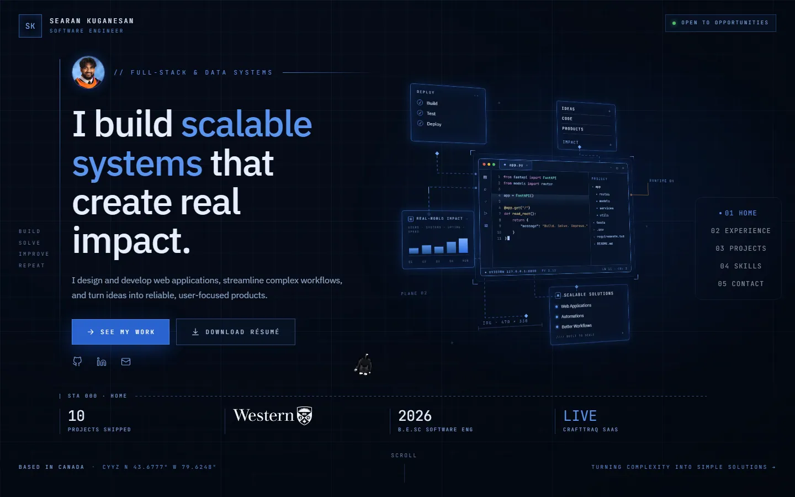 | 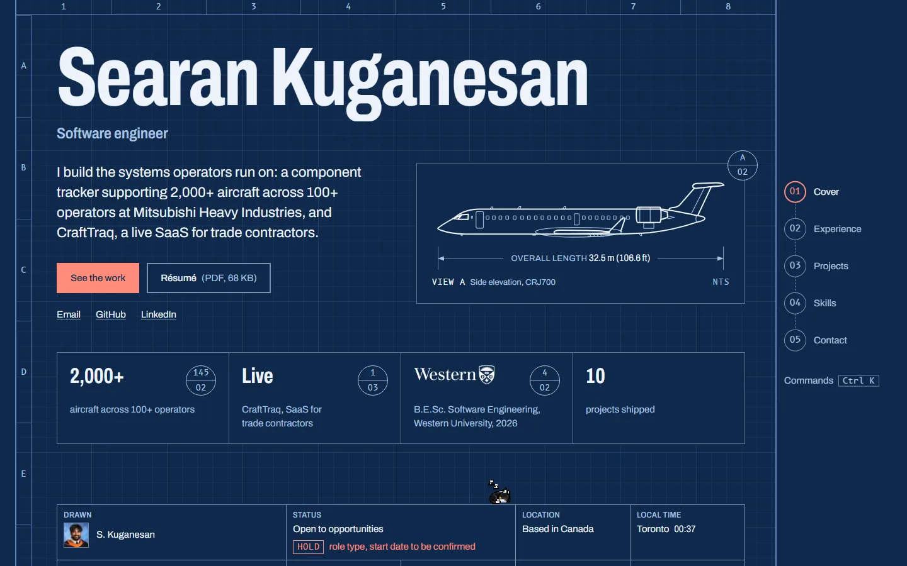 |
| Cover, 375 | 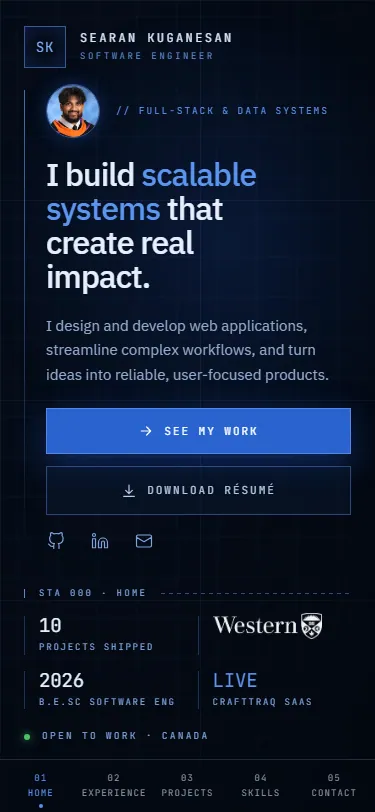 | 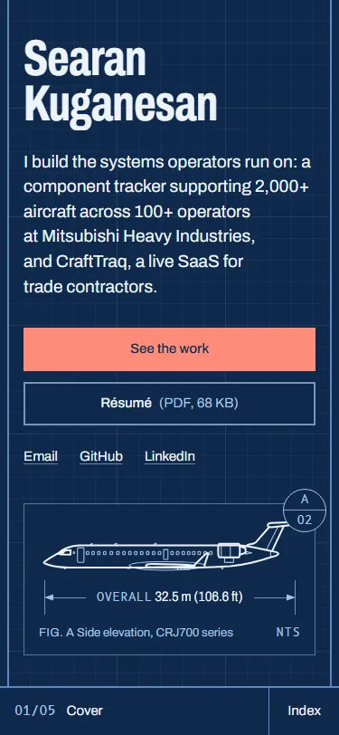 |
| Experience, 1440, end of survey | 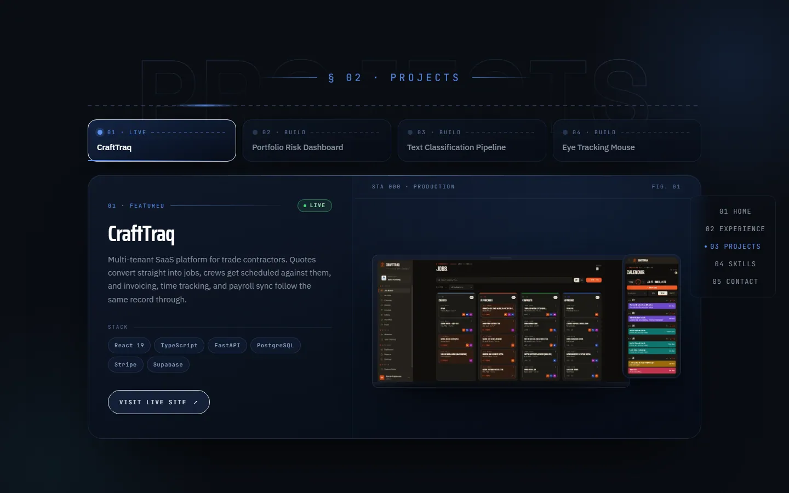 | 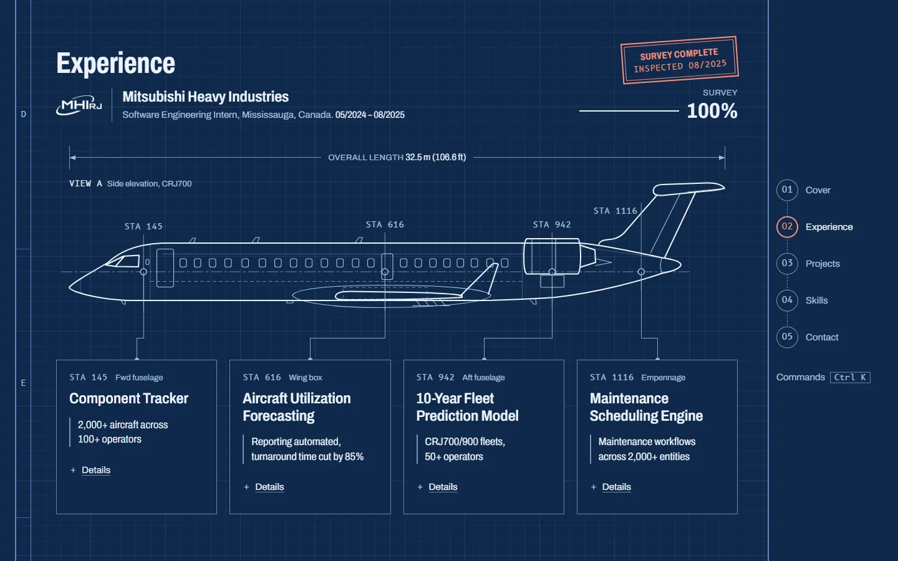 |
| Experience, 375 | 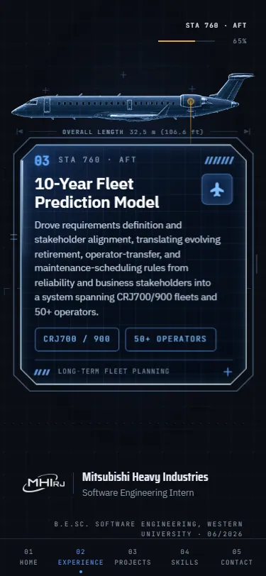 | 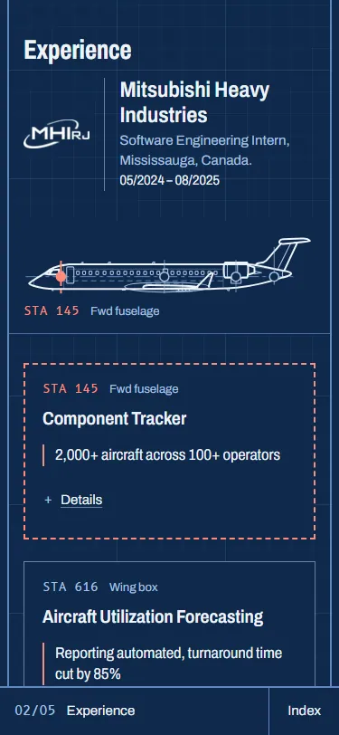 |
| Projects, 1440 | 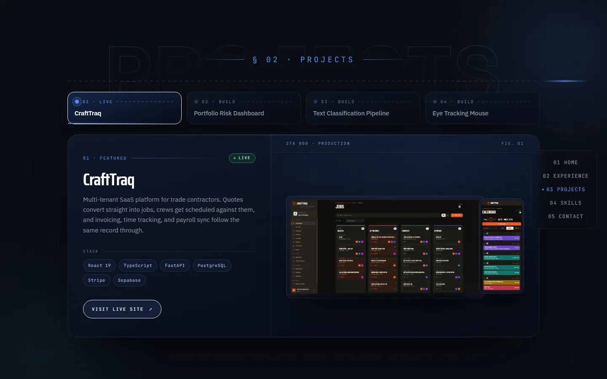 | 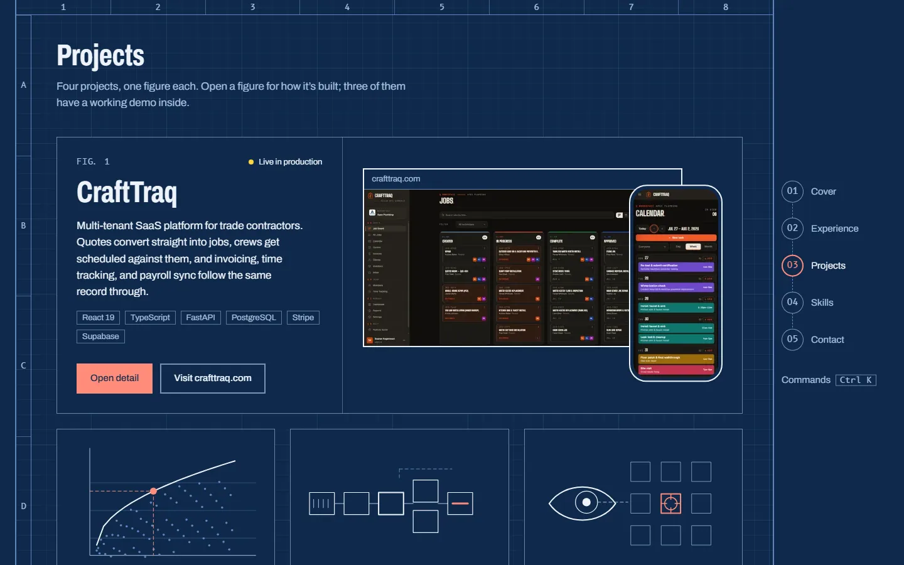 |
| Skills, 1440 | 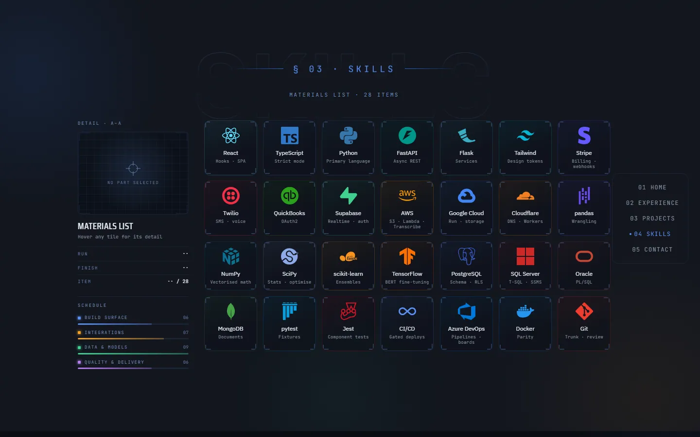 | 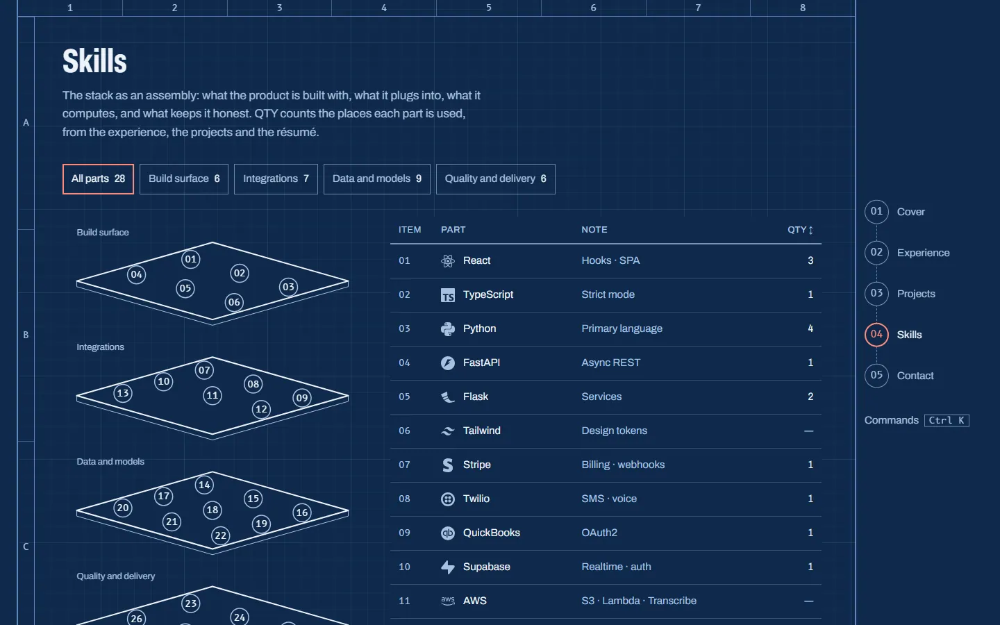 |
| Contact and ending, 1440 | 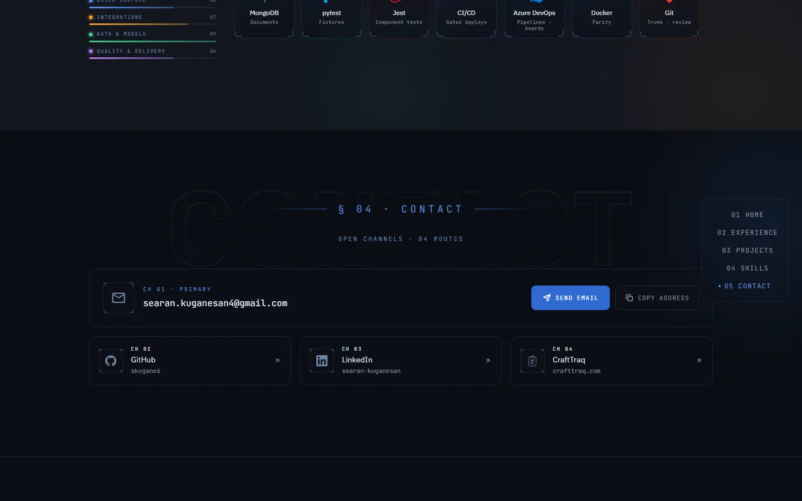 | 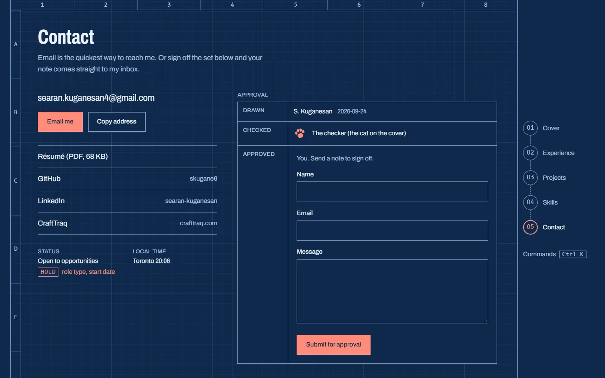 |

More captures:

- Survey states 0–100% at 1024, 1440 and 1920: `screenshots/after/experience/`.
- Every sheet at 375, 768, 1024, 1440 and 1920, plus full-page captures: `screenshots/after/<width>/`.
- Reduced motion at 375 and 1440: `screenshots/after/reduced-motion/`.
- The airframe drawing on its own: `screenshots/after/fixtures/airframe.webp`.
- The link preview: `public/og.png`.

---

## 2. Metrics

All "after" numbers are from the production build (prerendered, served locally with `vite preview`), measured with the same tools as the baseline. Lighthouse figures are medians: 3 runs before, 5 after.

| Metric | Before (local build) | Before (production) | After | Target |
|---|---|---|---|---|
| Lighthouse mobile: performance / a11y / best practices / SEO | 72 / 90 / 100 / 100 | 60 / 90 / 100 / 100 | **100 / 100 / 100 / 100** | ≥ 90 / 100 / ≥ 95 / 100 |
| Lighthouse desktop | 98 / 90 / 100 / 100 | 97 / 90 / 100 / 100 | **100 / 100 / 100 / 100** | |
| Mobile LCP (simulated slow 4G, 4× CPU) | 4.86 s | 6.58 s | **1.66 s** | ≤ 2.0 s |
| Mobile FCP | 3.65 s | 3.74 s | **1.09 s** | |
| Mobile TBT (INP stand-in) | 173 ms | 284 ms | **19 ms** | INP ≤ 200 ms |
| CLS | 0 | 0 | **0** (0.046 worst of 5 runs) | ≤ 0.05 |
| Initial JavaScript, gzip | 137 KB (+136 KB cat) | | **112 KB** | ≈ ≤ 200 KB |
| Everything loaded on first view | 1.54 MB | | **280 KB** | |
| Fonts | 5 families, 127 KB, render-blocking from Google | | 2 families, 66 KB, self-hosted, subset, preloaded | |
| Largest image | 948 KB PNG airframe | | airframe is inline SVG; largest image at load 19 KB | |
| axe WCAG 2.2 A/AA violations (16 states, 375 + 1440) | serious in all 16 | | **0 in all 16** | 0 |
| Text under 12 px at 375 | 228 of 293 nodes | | **0 of 436** (none under 13 px) | none under 12 |
| Text failing 4.5:1 | 28 (375), 29 (1440) | | **0** (lowest ratio 6.38:1) | 0 |
| Experience scroll, desktop, 4× CPU | 16.8 fps, p50 frame 55 ms, 41 long tasks | | **78.6 fps, p50 12 ms, 1 long task** | 60 fps |
| Main-thread busy while idle (cover / contact) | 95% / 99% | | **8% / 14%** | |
| Phone viewport, whole-page scroll, 4× CPU | not measured | | **p95 frame 16.7 ms, 0 long tasks** | |
| Infinite animations running | 32, never paused | | **0 ambient loops** (the cat naps only while on screen) | |
| Share metadata | title and description only | | OG and Twitter image, favicon set, manifest, Person JSON-LD, sitemap, robots, canonical | |

Raw data:

- Baseline: `audit/perf/`, `audit/a11y/`.
- After: `audit/perf-after/lighthouse-summary.json`, `audit/perf/runtime-after-x4.json`, `audit/a11y-after/`.

Tests: 146 unit tests and 95 Playwright end-to-end checks, run against the production build at 1440 and at 375 with touch. The end-to-end run includes axe on every sheet, both dialogs and the palette. `npm run lint` and `npm run typecheck` are clean, and `npm run check:bundle` enforces the JavaScript budget.

---

## 3. What changed, and why

**One concept, carried to every sheet.** The audit found the drawing idea fully committed only in Experience. Now every sheet has a zone-referenced frame and a title block, with sheet number, title, the git revision it was built from, and the date. The nav rail is the sheet index, and its numbers match the title blocks (the old site had 01 Home in the nav but "§ 01 Experience" as the heading). Chrome that carried no information is gone: ghost words, eyebrows, the fake IDE, "Build / Solve / Improve / Repeat". Each mark that remains means something. Stations are real positions on the drawing. Detail bubbles are links to the sheet that proves a claim. QTY in the bill of materials is counted from where a part is actually used. HOLD marks information not yet released.

**The cover answers the recruiter's first question.** The name is the heading. The positioning line names the employer, the scale and the live product. The proof items link to their evidence on the page. The title block holds status, datum, live Toronto time and revision. The old hero's copy was generic and its illustration had no data behind it.

**The flagship, rebuilt rather than replaced.** The 948 KB raster airframe is now SVG line art, traced from it and grouped by drawing convention: object, thin, hidden, centre and panel lines. It plots itself as you arrive. The survey then pins, and each callout docks fore to aft: its station lights, a three-stroke leader draws, and the card appears. It reaches **100%** and the "Survey complete, inspected 08/2025" stamp lands; the old survey stopped at 87–91%. Cards lead with a verbatim impact line; the full text is one disclosure away. Stations and cards highlight each other. Keyboard focus completes the survey at once, so nothing focusable is ever invisible. Phones get a sticky airframe above normal-flow cards, lit by the card being read, instead of the desktop pin shrunk down. Reduced motion gets the finished sheet.

**Projects: all visible, each with depth.** Tabs are gone, and the four projects are figures. CraftTraq's real screens sit in drawn device frames. Each project opens a detail sheet in a native modal dialog that grows out of its figure. The sheet is linked at `#projects/<id>`; Back and Escape close it and focus returns to where it was. It covers what the project does and how it's built (from your résumé), where it stands, the stack, links, and an architecture diagram routed from content data. Three detail sheets have demos:

- **Portfolio risk:** real Modern Portfolio Theory, efficient frontier, Sharpe and parametric VaR, running on three clearly labelled made-up assets.
- **Text classification:** a logistic-regression model trained for this page on 30,000 Amazon reviews (Apache-2.0). It scores 90.0% on 5,000 held-out reviews, a figure the page reads from the model file, and it states that it isn't your BERT ensemble.
- **Eye tracking:** opt-in, using MediaPipe Face Landmarker on the device, with 5-point calibration and blink-to-click. The download size and Google's telemetry are disclosed before it starts, and it falls back to a simulation.

The old visuals' unsourced numbers are gone, and a test keeps them out.

**Skills become a bill of materials.** Group filters carry counts, and every part is a button, so tap, click and Enter all work. The detail panel shows where the part was used, linked to the exact card, project or résumé line. By default it shows the five most-used parts instead of "No part selected". An exploded view of four plates separates as the sheet scrolls in.

**An ending.** Contact is a sign-off block: drawn by you, checked by the cat, approved by the visitor, who can send a note through `/api/contact` (Resend) or fall back to a prefilled email. The footer is a revision block built from git.

**Personality, with rules.** The cat now lives on the cover's title-block rule. It naps, looks up at a nearby pointer, walks when woken, and signs the sheet if pestered five times. It can't reach content; on phones it used to sit on the main button. The rest:

- a command palette (Ctrl/⌘ K);
- a drafting crosshair that reads out sheet, zone and millimetres, on fine pointers only;
- a first-visit plot-in of the frame, under a second and skippable;
- a note in the console.

**Engineering.**

- All content lives in typed modules under `src/content/`, with tests pinning the facts.
- The page is prerendered at build time and hydrated after the first paint, with the stylesheet inlined.
- Font fallbacks are sized from measured width ratios, so the font swap moves nothing.
- Motion is the single animation runtime, loaded lazily.
- `vercel.json` makes hashed assets immutable.
- The vendored cat runtime (about 4,500 lines) is replaced by a 200-line component.
- ESLint is new and clean.

Dependencies added:

| Package | Why |
|---|---|
| `motion` | Replaces framer-motion; lazy features |
| `@mediapipe/tasks-vision` | Eye demo, loaded only on opt-in |
| `@playwright/test`, `@axe-core/playwright`, `lighthouse`, `rollup-plugin-visualizer` | Verification |
| ESLint and plugins | Lint |

Removed: `framer-motion`.

---

## 4. Known limitations

- **Not verified on real devices or with a real camera.** Touch was emulated. The eye demo's calibration and blink detection are unit-tested with synthetic landmarks and were never run against a face.
- **Synthesized touch scrolling doesn't work in this machine's headless Chromium**, even on a plain test page (`scripts/audit/touch-scroll-probe.mjs`). The phone runtime figure therefore comes from wheel scrolling at a phone viewport.
- **Lighthouse is simulated and noisy.** One of five mobile runs scored LCP 2.21 s and CLS 0.046, still inside targets. The measurements are local builds served by `vite preview`, not Vercel's edge; a preview deploy would give production numbers.
- **Font-swap residue at 360 and 390 px:** the cover's proof labels wrap about 20 px differently in the fallback face, below the fold (`scripts/audit/font-shift.mjs`). Some symbols (⌘, →, Σ) aren't in the font files Google serves for Latin, so they render from system fonts, as they did before.
- **Delayed interactivity on slow connections.** The app starts after the page has painted. Links work immediately, but buttons (Details, Open detail, the palette) wait for hydration, a few hundred ms on slow 4G.
- **No print stylesheet.** The whiteprint idea in DESIGN.md Q4 wasn't built; printing gives the dark page.
- **The contact form sends only once `RESEND_API_KEY` and `CONTACT_TO` are set.** Until then it opens a prefilled email and says so.
- **Placeholders you need to fill:** role type and start date (the HOLD), and the other items in `NEEDS-FROM-SEARAN.md`.
- **Assets:** `public/crafttraq.png` (the old screenshot with test jobs) is still served but unreferenced, and `check.png` is still in the repo root. Both are kept per your brief.
- The old audit scripts in `scripts/audit/` are kept for reproducibility, and a few (`a11y-contrast.mjs`, `a11y-keyboard.mjs`) are tied to the old markup. The new checks live in `e2e/` and the newer `scripts/audit/*` files.

## 5. Reviews

A fresh code reviewer and a separate design reviewer, working from screenshots only, reviewed the branch. What they found and what was done about it: §6.
